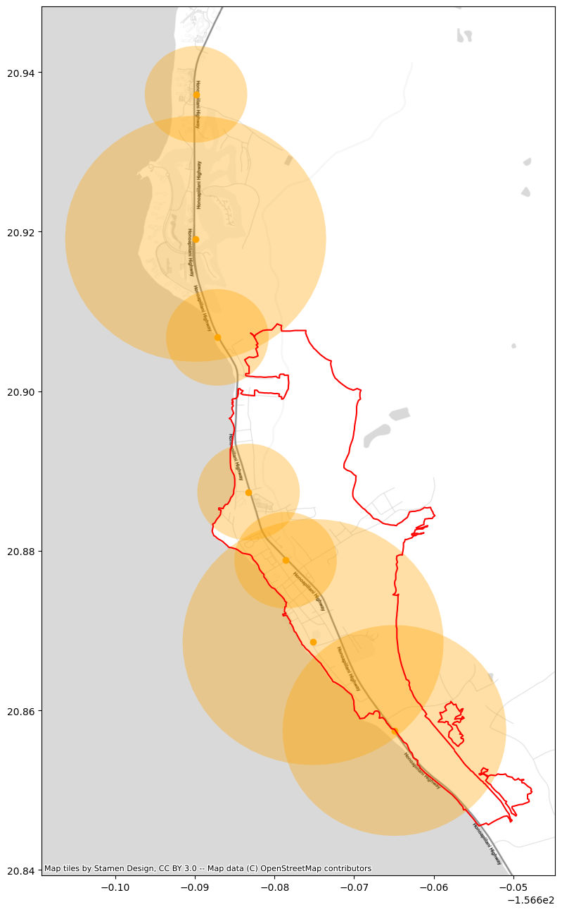

# Lahaina Sirens

This repository contains code to reproduce the following finding, featured in the Scripps News investigation ["Maui fires are another disaster in which warning sirens stayed silent"](https://scrippsnews.com/stories/maui-fires-are-another-disaster-in-which-warning-sirens-stayed-silent/), by Patrick Terpstra, and Rosie Cima published on Aug 16, 2023.

```A Scripps News analysis comparing siren locations around Lahaina to a map of fire damage shows the sirens should have been audible in most of the burned area, at least to people who were outside. ```

## Source Data

The main data source for this piece was a [map of siren locations, decibels, and ranges](https://www.mauisirens.com/) published by the Maui Emergency Management Agency (MEMA).

We also used information from a map of the estimated damage that MEMA [released August 12th](https://www.mauicounty.gov/CivicAlerts.aspx?AID=12683) -- [mema--damage_assessment_map.jpeg](data/source/mema--damage_assessment_map.jpeg)

## ETL

All the etl for this piece is in the file [etl.py](etl.py), which should be run in the terminal. 

1. Fetch all the siren data from the API endpoint for the map -- **maui_sirens**, 80 records
2. Manually define a bounding box of coordinates that are near the burn perimeter, and classify each siren by whether or not they are (column 'near_bp')
3. Manually confirm that the 9 sirens in **maui_sirens** without 'Lat' or 'Lon' coordinates are not in that bounding box. Look them up using the 'Name' field.
4. Save the sirens in **maui_sirens** with 'Lat' and 'Lon' coordinates to a geopandas data frame, and a geojson file -- **maui_sirens_geo**, [maui_sirens--coord_map.geojson](data/processed/maui_sirens--coord_map.geojson), 71 records
5. For those sirens in **maui_sirens_geo** with an estimated operating range ('Range_ft'), draw a buffer surrounding each siren with a radius corresponding to that range. Save to another geojson file -- **maui_sirens_buff**, [maui_sirens--buffer.geojson](data/processed/maui_sirens--buffer.geojson), 69 rows

In [QGIS](https://qgis.org/en/site/), we georeference [mema--damage_assessment_map.jpeg](data/source/mema--damage_assessment_map.jpeg) and then trace the burn perimeter, saving it as [burn_perimeter.geojson](data/manual/burn_perimeter.geojson)

## Analysis

The etl for this piece is in the file [analysis.ipynb](analysis.ipynb). We load the two spatial data sets from our ETL:
* [maui_sirens--coord_map.geojson](data/processed/maui_sirens--coord_map.geojson)
* [maui_sirens--buffer.geojson](data/processed/maui_sirens--buffer.geojson)

We filter both of these down to the sirens classified as 'near_bp', plot with a basemap and [burn_perimeter.geojson](data/manual/burn_perimeter.geojson)



We reproduce this in a [Datawrapper locator map](https://www.datawrapper.de/_/qOoy8/).

## Other data elements
In the video piece, there is a map of sirens statewide. This information was taken from (Department of Defense - State Civil Defense Emergency Siren Locations)[https://opendata.hawaii.gov/dataset/department-of-defense-state-civil-defense-emergency-siren-locations], which closely corresponds to MEMA's published data for Maui. 

Note that, as the data was last updated in December of 2019, it is significantly outdated and likely underestimates the extent of the statewide siren system. It only records 340 sirens compared to the ["more than 400" the Hawaii Emergency Management Agency reported in May, 2023](https://dod.hawaii.gov/hiema/news-release-whats-that-sound-hawaii-emergency-management-agency-to-test-four-new-or-updated-sirens-on-big-island-this-friday/).